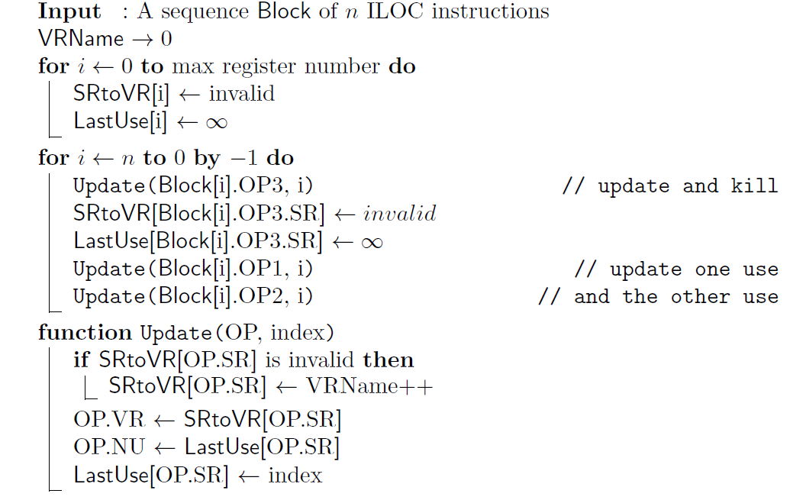
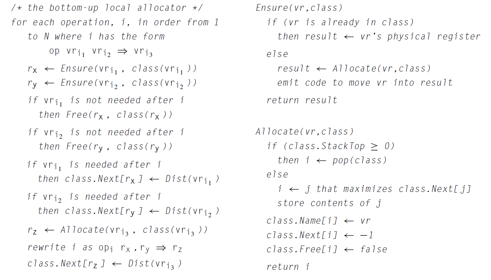
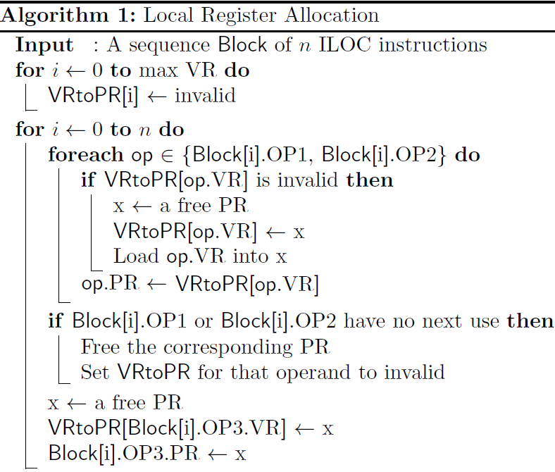

## Specification

For the purposes of this project, two blocks are equivalent if they output same values in the same
order, and each data-memory location defined by an execution of the input block receives the same
value in the output block. It is permissible for the output block to define additional data memory
locations that hold spilled values.

Your allocator **must** only perform register allocation. No other optimization is allowed. While
you could execute the input block and replace it with a series of output and store operations, this
is forbidden. The output block **must** contain all of the arithmetic operations, in the same sequence,
as the input block. The goal is to focus on the problems that arise in a local register allocator,
not to capitalize on the simplified form of the ILOC test blocks. *You **must** not use hashtables for
this project.*

Before submitting your program, test it thoroughly on all provided blocks.

### Core Project: Naive Allocator

Your input and output are a single basic block, consisting of
instructions from the same subset of ILOC as Project 1. You should use the scanner and parser you built in Project 1 for this project. 
Be sure to fix any parsing or lexing errors from Project 1, as they will count as failures for this project.

The new component of your project is to implement the bottom-up,
local, register allocator described below, and drawn from Figure 13.1, page 687, of Engineering a
Compiler.

You will first need to compute, for each instruction, the next use of each operand. Along the way,
it is highly recommended that you rename the registers, giving a unique virtual register to each
*live range* using [Algorithm: Compute Last Use](#algorithm-compute-last-use).  This helps separate the
*definition* of a register from a *use* of a register. To compute the number of live registers, keep
track of the number of valid entries in the table.

To allocate the registers, you will use the allocation algorithm detailed in
[Algorithm: Allocate](#algorithm-allocate).  This will require you to spill some register values into
memory. Note that each integer requires four bytes. Memory locations 0 through 32767 are user
memory, and are reserved for use by ILOC input blocks. Locations starting at 32768 in data memory
are reserved for the register allocator. Your allocator can safely store spilled values into these
locations.

You **should** use different fields to store the source register, virtual
register, and allocated physical register of each operand, along with all necessary annotations like
next use. The algorithm here use the fields `SR`, `VR`, `PR`, and `NU` for the source
register, virtual register, physical register, and next use value. These algorithms assume each
instruction has three operands. Modifying them to work with the full range of instructions is left
as an exercise for the implementor.

As a reminder, a `store r1 => r3` instruction does not define a register.
The second operand, `r3`, is a *use*, even though it occurs on the
right of a `=>`. You **must** to treat both operands as uses.

<div class="centering">

------------------------------------------------------------------------
#### Algorithm: Compute Last Use


___

------------------------------------------------------------------------
#### Algorithm: Allocate


___
</div>

This algorithm uses a class to hold information about each type of register: there is only one class
of registers (integer) for this project. Each class has a stack, which is checked for
emptiness by comparing `StackTop` to zero. The class has three tables, mapping physical registers to
virtual registers (`Name`), next use (`Next`), and current status (`Free`). You will likely need to
include more tables, as that this version does not (directly) map virtual registers to their
physical registers or memory addresses, nor remember any other information. The function `Free` is
also undefined, but can be inferred. It may help to look at the abstracted version used in class,
provided in the [Appendix A](#appendix-a-abstracted-allocation-algorithm).

### Full Credit: Optimizations and Heuristics

Your final deliverable **should** improve upon this naive algorithm. Your goal is to minimize the total
number of cycles that the allocate code uses.  You will optimize your allocator by avoiding
unnecessary memory operations for certain values. There are three conditions that will result in a
value in a register not needing to be stored to memory on a spill: it may be *rematerializable*,
already *spilled*, or *clean*.  Modify your allocator to take advantage of these kinds values and improve
the resulting code.

1.  A *rematerializable* value is the result of a `loadI` instruction.  Instead of spilling and
	reloading a rematerializable value, the allocator can load the constant with another `loadI`
	instruction.  This replaces 6 cycles of work with 1.

2.  A *spilled* value is the result of a `load` instruction from the area of memory reserved for
	spilling. This value still resides in memory, and so does not need to be stored. It can be
	reloaded directly from the existing memory location. This replaces 6 cycles of work with 3.

3.  A *clean* value is the result of *some* `load` instruction from user memory. However, for a
	value to be clean two conditions must be met. First, you must be able to determine the location
	it was loaded from. Second, you must verify that the location will not be modified (dirtied) by
	a `store` before the next use. When you can ensure both conditions, you can replace 6 cycles of
	work with 3. Be sure you do not sacrifice correctness for efficiency!

Once you have optimized spills, you need to reconsider how you choose which registers to spill. In
the naive algorithm, you always choose the register with the furthest next use. When all spills were
equal, this was clearly a good heuristic. Now that clean spills are quicker than dirty spills, this
is not always the case. In fact, determining the optimal choice of which registers to spill is
NP-complete. Sometimes it will be better to always pick the cheapest, clean value. Other times it is
better to pick the furthest value, even if it is dirty. You must develop a heuristic that gives you
good results. Test your heuristic widely on the sample blocks, using a variety of number of
registers.

## Implementation Details

### Interface

Your project **must** reside in the GitHub classroom repository. Your code
**must** compile on the `janus` machines, using a Makefile in the top-level
directory, to an executable named `alloc` in that directory.  Your program **must** implement the
following command line arguments.

```
-h  		Print a list of valid command-line arguments and descriptions to stdout and quit.

-k num  	Specify the number of registers available for the output. 
```

If the `-k` flag is not provided, you **may** use a default value, or exit with a help message. If the `-h` flag is not provided, you **must** accept one non-option argument `filename`, which will be an input file containing an ILOC block. If it is not provided you **may** read the input from `stdin`, or exit with a help message.

The output **must** consist of a sequence of valid operations that use only
the registers from 0 to $k-1$. The output **must** be equivalent, as stated
above, and **must** be written to stdout. Error messages for invalid
arguments or an invalid file **should** be reasonable and printed to stderr.

You **may** include other command-line arguments or flags for your program. if you do, you **must**
modify this file to place a Usage section at the top.

### Infrastructure

You have a directory [blocks](blocks) that contains a a number of sample blocks. Each block has a comment with a sample input and expected output when simulated (see below).

On the `janus` machines, a number of tools and reference files are available in the directory `/users/sfogarty/tools_csci3396/allocator`. 

* **alloc\_ref**:  A reference allocator. In addition to the required flags and output, it outputs comments noting the original instructions as well as any spill or restore code, and supports the `-s n` flag to output source, virtual or physical registers.
* **sim**: A simulator. Running `./sim -h` will display details, but the usual invocation is `./sim < file` or `alloc file > sim`. The `-i nums` flag lets you initialize memory. The first number is the starting location, the every number after that populates 4 bytes. The `-r NUM` flag allows you to set the number of registers.
* **Makefile**:  The makefile for the reference implementation, free for you to modify. It is not as fully-featured as the makefile provided for Project 0.
* **blocks**: the same sample blocks provided in this repository.
* **TestAlloc** A script to test your implementation. The normal use is  +./TestAlloc \<allocator\> \<directory\> \<k\>+
* **test\_opts** An even more basic script to test optimizations. Just run it on your allocator.

## Appendix A: Abstracted Allocation Algorithm

<div class="centering">


</div>

### Appendix B: ILOC Subset


|             Syntax                   | Meaning                 | Latency |
|:-----------------------------------|:------------------------|:--------|
| `load    r1       => r2`  | r2 $\gets$ MEM (r1)     | `2`      |
| `loadI   x        => r2`  | r2 $\gets$ x            | `1`      |
| `store   r1       => r2`  | MEM(r2) $\gets$ r1      | `2`      |
| `add     r1, r2   => r3`  | r3 $\gets$ r1 + r2      | `1`      |
| `sub     r1, r2   => r3`  | r3 $\gets$ r1 - r2      | `1`      |
| `mult    r1, r2   => r3`  | r3 $\gets$ r1 \* r2     | `1`      |
| `lshift  r1, r2   => r3`  | r3 $\gets$ r1 $\ll$ r2  | `1`      |
| `rshift  r1, r2   => r3`  | r3 $\gets$ r1 $\gg$ r2  | `1`      |
| `output  x             `  | prints MEM(x) to stdout | `1`      |
| `nop                   `  | idle for one cycle      | `1`      |

All register names have an initial r followed immediately by a non-negative integer. Leading zeros in the register name are not significant; thus, `r017` and `r17` refer to the same register. Arguments that do not begin with `r`, which appear as `x` in the table above, are assumed to be positive integer constants in the range $0 \ldots 2^{31} - 1$.

All ILOC operations in input blocks **must** begin on a new line. The code will contain commas and the assignment arrow `=>`. Spaces and tabs are treated as whitespace. ILOC opcodes **must** be followed by whitespace, which may be a newline in the case of `nop`.  Whitespace preceding and following all other symbols is optional.  Whitespace **must not** occur within operation names, register names, or the assignment symbol. All other whitespace **must** be ignored. A double slash (//) indicates that the rest of the line is a comment and **may** be discarded. Empty lines **should** also be discarded.

If you are curious, Appendix A of Engineering a Compiler provides details on these instructions, with the exception of the output operation. The output operation prints a value from memory to stdout.
